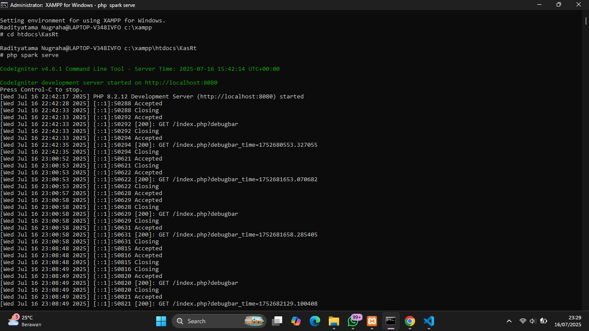
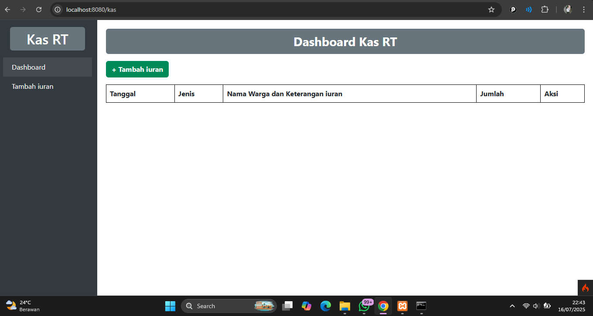
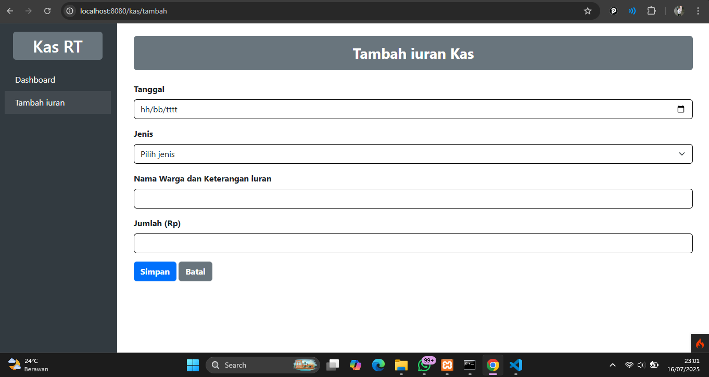
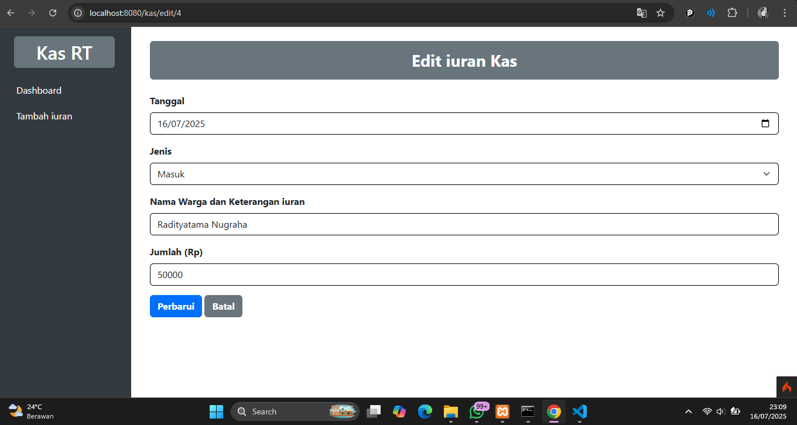
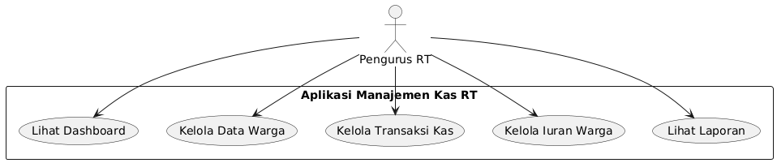
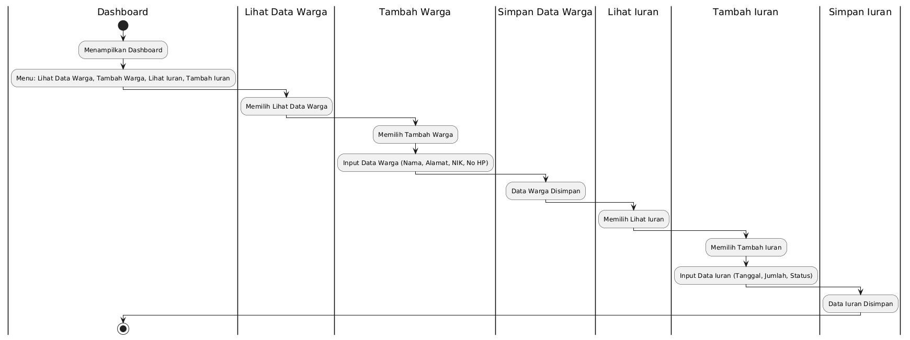
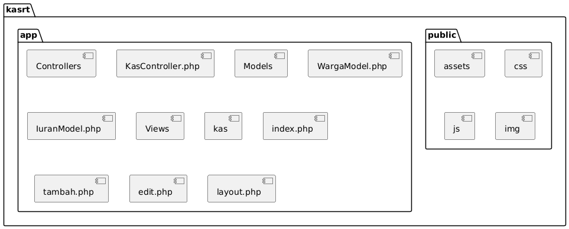
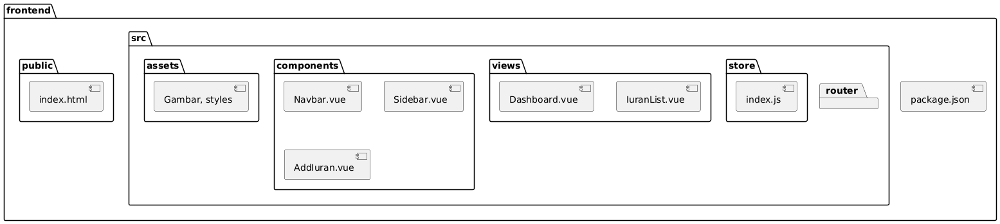

# UAS Pemrograman Web 2 Manajemen Kas Rt

|Nama|NIM|Kelas|Mata Kuliah|
|----|---|-----|------|
|**Radityatama Nugraha**|**312310644**|**TI.23.A6**|**Pemrograman Web 2**|
|**Fajar Julianwar**|**312310672**|**TI.23.A6**|**Pemrograman Web 2**|
|**Gusti Ardhya Nanda Fahreza**|**312310624**|**TI.23.A6**|**Pemrograman Web 2**|
|**Agus Setiawan**|**312310597**|**TI.23.A6**|**Pemrograman Web 2**|

## Cara Menjalankan Website Menggunakan Shell di XAMPP


## Halaman Dashboard
### KasRt/app/Views/kas/index.php
```php
<?= $this->extend('layout') ?>
<?= $this->section('content') ?>

<!-- Konten HTML -->
<div class="mb-3">
    <div class="bg-secondary text-white rounded text-center fw-bold py-2 px-4 mb-3 fs-3" style="width: 100%;">
        Dashboard Kas RT
    </div>

    <a href="/kas/tambah" class="btn btn-success fw-bold">+ Tambah iuran</a>
</div>


<table class="table table-bordered">
    <tr>
        <th>Tanggal</th>
        <th>Jenis</th>
        <th>Nama Warga dan Keterangan iuran</th>
        <th>Jumlah</th>
        <th>Aksi</th>
    </tr>
    <?php foreach ($kas as $row): ?>
        <tr>
            <td><?= $row['tanggal'] ?></td>
            <td><?= ucfirst($row['jenis']) ?></td>
            <td><?= $row['keterangan'] ?></td>
            <td>Rp <?= number_format($row['jumlah']) ?></td>
            <td>
                <a href="/kas/edit/<?= $row['id'] ?>" class="btn btn-warning btn-sm fw-bold">Edit</a>
                <a href="/kas/hapus/<?= $row['id'] ?>" onclick="return confirm('Yakin?')" class="btn btn-danger btn-sm fw-bold">Hapus</a>
            </td>
        </tr>
    <?php endforeach ?>
</table>
</div>

<?= $this->endSection() ?>
```


## Halaman Tambah iuran
### KasRt/app/Views/kas/tambah.php
```php
<?= $this->extend('layout') ?>
<?= $this->section('content') ?>

<style>
    input.form-control,
    select.form-select,
    textarea.form-control {
        border: 1px solid #000 !important;
        box-shadow: none !important;
    }
</style>

<div class="container mt-1">
    <div class="bg-secondary text-white rounded py-3 px-4 mb-4 w-100 text-center">
        <h3 class="mb-0"><strong>Tambah iuran Kas</strong></h3>
    </div>
    <form action="/kas/simpan" method="post">
        <div class="mb-3">
            <label for="tanggal" class="form-label fw-bold">Tanggal</label>
            <input type="date" name="tanggal" id="tanggal" class="form-control" required>
        </div>
        <div class="mb-3">
            <label class="form-label fw-bold">Jenis</label>
            <select name="jenis" class="form-select" required>
                <option value="" disabled selected>Pilih jenis</option>
                <option value="masuk">Masuk</option>
                <option value="keluar">Keluar</option>
            </select>
        </div>
        <div class="mb-3">
            <label for="keterangan" class="form-label fw-bold">Nama Warga dan Keterangan iuran</label>
            <input type="text" name="keterangan" id="keterangan" class="form-control">
        </div>
        <div class="mb-3">
            <label for="jumlah" class="form-label fw-bold">Jumlah (Rp)</label>
            <input type="number" name="jumlah" id="jumlah" class="form-control" required>
        </div>
        <button type="submit" class="btn btn-primary fw-bold">Simpan</button>
        <a href="/kas" class="btn btn-secondary fw-bold">Batal</a>
    </form>
</div>

<?= $this->endSection() ?>
```


## Halaman Edit iuran
### KasRt/app/Views/kas/edit.php
```php
<?= $this->extend('layout') ?>
<?= $this->section('content') ?>

<style>
    input.form-control,
    select.form-select,
    textarea.form-control {
        border: 1px solid #000 !important;
        box-shadow: none !important;
    }
</style>

<div class="container mt-1">
    <div class="bg-secondary text-white rounded py-3 px-4 mb-4 w-100 text-center">
        <h3 class="mb-0"><strong>Edit iuran Kas</strong></h3>
    </div>

    <form action="/kas/update/<?= $kas['id'] ?>" method="post">
        <div class="mb-3">
            <label for="tanggal" class="form-label fw-bold">Tanggal</label>
            <input type="date" name="tanggal" id="tanggal" class="form-control" value="<?= $kas['tanggal'] ?>" required>
        </div>

        <div class="mb-3">
            <label class="form-label fw-bold">Jenis</label>
            <select name="jenis" class="form-select" required>
                <option value="masuk" <?= $kas['jenis'] == 'masuk' ? 'selected' : '' ?>>Masuk</option>
                <option value="keluar" <?= $kas['jenis'] == 'keluar' ? 'selected' : '' ?>>Keluar</option>
            </select>
        </div>

        <div class="mb-3">
            <label for="keterangan" class="form-label fw-bold">Nama Warga dan Keterangan iuran</label>
            <input type="text" name="keterangan" id="keterangan" class="form-control" value="<?= $kas['keterangan'] ?>">
        </div>

        <div class="mb-3">
            <label for="jumlah" class="form-label fw-bold">Jumlah (Rp)</label>
            <input type="number" name="jumlah" id="jumlah" class="form-control" value="<?= $kas['jumlah'] ?>" required>
        </div>

        <button type="submit" class="btn btn-primary fw-bold">Perbarui</button>
        <a href="/kas" class="btn btn-secondary fw-bold">Batal</a>
    </form>
</div>

<?= $this->endSection() ?>
```


## Template Dasar
### KasRt/app/Views/kas/layout.php
```php
<!DOCTYPE html>
<html>

<head>
    <title>Dashboard Kas RT</title>
    <meta charset="utf-8">
    <meta name="viewport" content="width=device-width, initial-scale=1">
    <link href="https://cdn.jsdelivr.net/npm/bootstrap@5.3.0/dist/css/bootstrap.min.css" rel="stylesheet">
    <style>
        body {
            min-height: 100vh;
            display: flex;
            flex-direction: column;
        }

        .sidebar {
            height: 100vh;
            background-color: #343a40;
            padding-top: 1rem;
        }

        .sidebar a {
            color: white;
            display: block;
            padding: 10px 20px;
            text-decoration: none;
            transition: background-color 0.2s;
        }

        .sidebar a:hover {
            background-color: #495057;
        }

        .sidebar a.active {
            background-color: rgba(255, 255, 255, 0.08);
        }

        .sidebar h4 {
            font-size: 1.6rem;
        }

        .content {
            padding: 20px;
        }

        /* Tambahan untuk garis tabel */
        table,
        th,
        td {
            border: 1px solid #000 !important;
        }

        table {
            border-collapse: collapse !important;
        }
    </style>
</head>

<body>
    <div class="container-fluid">
        <div class="row">
            <!-- Sidebar -->
            <nav class="col-md-2 d-none d-md-block sidebar">
                <div class="position-sticky">
                    <div class="text-white text-center bg-secondary rounded py-2 px-3 mx-3 mb-3">
                        <h2 class="mb-0">Kas RT</h2>
                    </div>
                    <a href="/kas" class="<?= current_url(true)->getSegment(1) == 'kas' && (current_url(true)->getTotalSegments() == 1) ? 'active' : '' ?>">Dashboard</a>
                    <a href="/kas/tambah" class="<?= current_url(true)->getSegment(1) == 'kas' && current_url(true)->getSegment(2) == 'tambah' ? 'active' : '' ?>">Tambah iuran</a>
                </div>
            </nav>

            <!-- Main Content -->
            <main class="col-md-10 ms-sm-auto col-lg-10 content">
                <?= $this->renderSection('content') ?>
            </main>
        </div>
    </div>

    <script src="https://cdn.jsdelivr.net/npm/bootstrap@5.3.0/dist/js/bootstrap.bundle.min.js"></script>
</body>

</html>
```

## Use Case Diagram


## Flowchart


## Struktur Folder


## Struktur Front End


## Link Video Demo
### https://youtu.be/9oq5V-9dT6Q?si=VR5M1gsGViELHkej

## Link Figma
### https://www.figma.com/design/4IzXk364SnZhFqbW9zBr8L/Untitled?node-id=0-1&t=1K952La69m1x64oK-1


